# Create a Basketball Game App in Unity: Part 1

## Prerequisites

**Unity**

The activity requires you to create an app in [Unity](https://unity.com/). If you don't already have Unity installed, visit [unity.com/download](https://unity.com/download) to download the Unity Hub. This activity can be completed with Unity version **2020.3.20f1** or newer.

**Visual Studio**

This activity requires you to create code in [Visual Studio](https://visualstudio.microsoft.com/downloads/). Ensure that Visual Studio is downloaded and set as the default editor for Unity. If you're unfamiliar with the steps to set Visual Studio as the default editor, review [Set Your Default Script Editor](https://learn.unity.com/tutorial/set-your-default-script-editor-ide#612f3e91edbc2a1b4b4418ee). This activity can be completed with **Visual Studio 2019** or newer.

## Instructions

In this activity, you'll create a Unity project for the basketball game and add GameObjects to the scene. You're welcome to use your own models if you prefer, however, recommended models are provided.

### Project Setup

1. Create a new Unity project using a **3D** template. Name the project **BasketballGame** and save it to your desktop.

    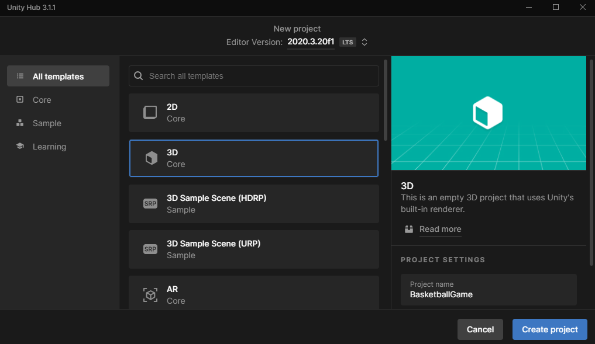

1. In the Unity editor, navigate to **File > Save As** to save the scene. Name the scene **Unit-6**.
1. Provide a **Company Name** and **Product Name** for the app. To do so, navigate to **Edit > Project Settings > Player**.
1. In the **Project** window, create the following 4 folders inside the **Assets** folder:
    - Materials
    - Models
    - Prefabs
    - Scripts

    To create a new folder, right click into the **Assets** folder and select **Create > Folder**.

    

### Create a Basketball Court

The scene needs to be grounded onto a flat surface so that the player has a surface to move back and forth on to take a shot. The **Plane** primitive is ideal for creating flat ground surfaces. Create a basketball court for the game.

1. In the **Hierarchy** window, right click and select **3D Object > Plane**. Name the object **Court**.

    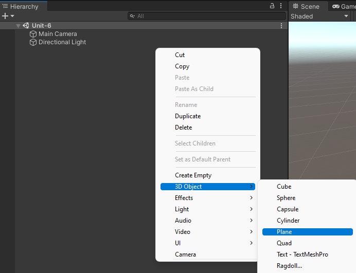

    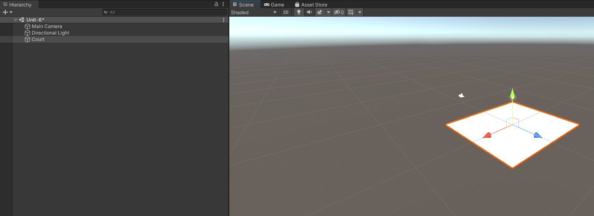

1. Create and assign a **Material** to the **Court** GameObject. To create a new material, in the **Project** window, right click into the **Materials** folder and select **Create > Material**. Using the **Albedo** property, choose a color of your choice. Then, drag the material to the **Court** GameObject.

    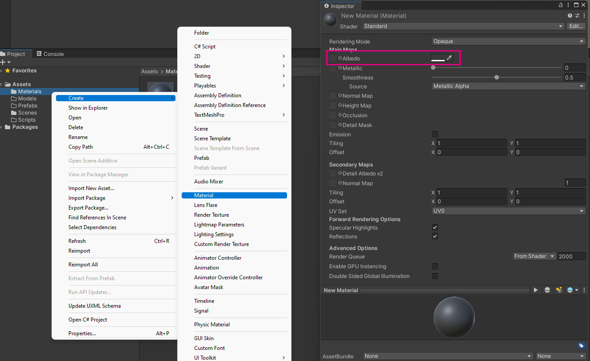

### Create a Player

The game needs an object to serve as the player for the game. Since this is a prototype, you can use a Unity primitive (such as a **Cube** reshaped to a vertical rectangle) to represent the player. Create a player and reposition so that they're leveled with the basketball court.

1. In the **Hierarchy** window, right click and select **3D Object > Cube**. Name the object **Player**.

    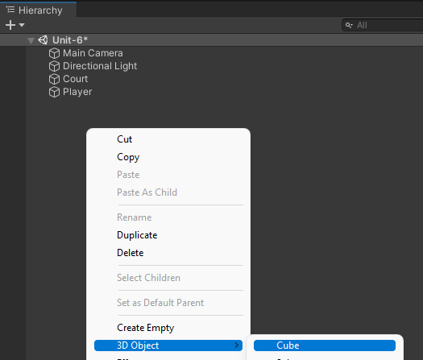

1. Modify the **Player Transform Scale Y** to **4**. This extends the height of the **Player** GameObject to create a vertical rectangle.

    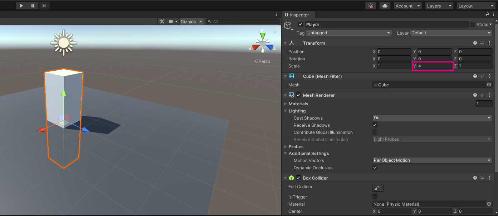

1. Create and assign a **Material** to the **Player** GameObject. To create a new material, in the **Project** window, right click into the **Materials** folder and select **Create > Material**. Using the **Albedo** property, choose a color of your choice.

    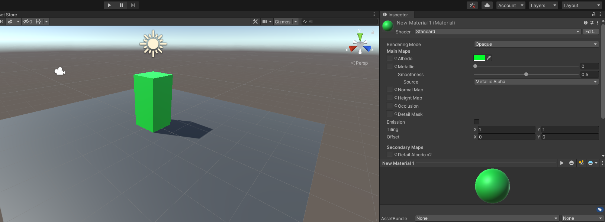

1. The **Player** is positioned in the middle of the court. Raise the player so that they're leveled with the ground. Modify the **Player Transform Position Y** to **2**.

    

1. Since the basketball hoop will display on the far end of the court, the **Player** should be positioned at the opposite end of the court. Modify the **Player Transform Position Z** to **-4**.

    

### Create a Basketball Hoop

Create or import a basketball hoop model position towards the back of the court.

1. [Download](https://www.cgtrader.com/free-3d-models/sports/equipment/basket-ball-hoop-cde8ef2d-fe2c-49db-962f-bd79d410c299) the basketball hoop model from CGTrader. Make sure to select the **.fbx** file.

1. Rename the model **basketball-hoop** and drag the model into the **Project** window's **Models** folder to import into your project.

    

1. Drag the **basketball-hoop** model into the scene. The model comes with it's own **Camera** GameObject. Expand the children of the **basketball-hoop** GameObject and disable the **Camera** GameObject.

    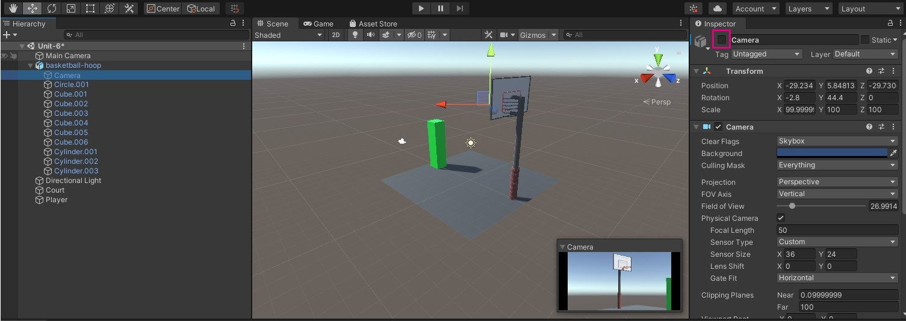

1. The **basketball-hoop** needs to be resized to fit the scale of the **Player**. Modify the **basketball-hoop Transform Scale** to **0.5, 0.5, 0.5**.

1. The **basketball-hoop** should be positioned at the opposite end of the **Court**. Modify the **basketball-hoop Transform Position Z** to **4**.

    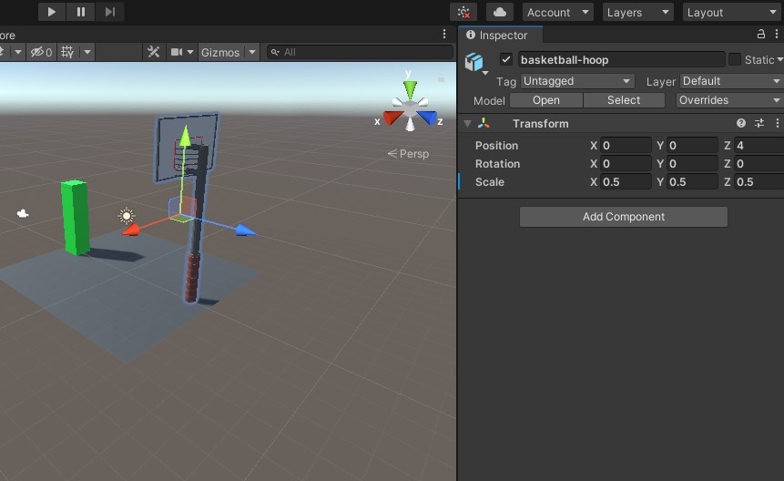

### Create a Basketball

Each time the player takes a shot, a new ball instantiates so that they can take another shot. Create or import a basketball model and turn the model into a prefab.

1. [Download](https://sketchfab.com/3d-models/basketball-536d687777f0473dbc79f00ea4a17917) the basketball model from Sketchfab. After the model downloads, unzip the content within the folder.

    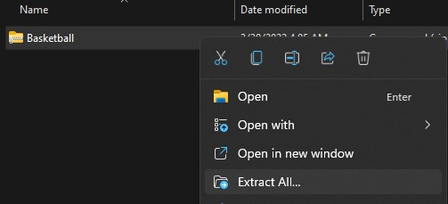

1. Drag the model's folder into the **Project** window's **Models** folder to import into your project.

    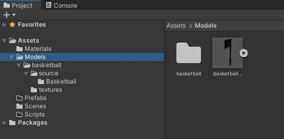

1. Drag the **basketball** model into the scene. The **basketball** needs to be resized to fit the scale of the **Player**.Modify the **basketball Transform Scale** to **.04, .04, .04**.

    (Note: To fully view the **basketball**, you may need to increase the **Position Y**. Be sure to change back to **0** before proceeding to the next step.)

    

1. Imported models are already created as a prefab. However, you can modify the prefab and either save the changes to the original prefab *or* create as a new prefab variant. Drag the **basketball** model into the **Prefabs** folder and create as a **Prefab variant**. Rename the model **basketball**.

    

    Note: If you chose to create your own basketball from scratch, drag the basketball model into the **Prefabs** folder to create as a prefab.

1. Now that the **basketball** prefab has been created, delete the existing **basketball** GameObject into the **Hierarchy**. If you drag the new prefab into the **Hierarchy** window, the prefab will reflect the configuration you created for the prefab.

    

## Solution

To view the project sample for this activity, import the **Unit 6 Assignment** Unity package that's within the [XR Development for Beginners](https://github.com/microsoft/xr-development-for-beginners) repository.

**How to Import a Package into Unity**

1. In top navigation menu, select **Assets > Import Package > Custom Package**.
1. In the **Import Unity Package** window, select **All** then **Import**.
1. Once the package is imported, open the **Unit-6** scene.