# Create a Basketball Game App in Unity: Part 2

## Prerequisites

**Unity**

The activity requires you to create an app in [Unity](https://unity.com/). If you don't already have Unity installed, visit [unity.com/download](https://unity.com/download) to download the Unity Hub. This activity can be completed with Unity version **2020.3.20f1** or newer.

**Visual Studio**

This activity requires you to create code in [Visual Studio](https://visualstudio.microsoft.com/downloads/). Ensure that Visual Studio is downloaded and set as the default editor for Unity. If you're unfamiliar with the steps to set Visual Studio as the default editor, review [Set Your Default Script Editor](https://learn.unity.com/tutorial/set-your-default-script-editor-ide#612f3e91edbc2a1b4b4418ee). This activity can be completed with **Visual Studio 2019** or newer.

**Unit 6 Activity Project**

This activity picks up at the conclusion of the Unit 6 activity. If you haven't completed the activity, download and open the [Unit 6 Activity Project](/assets/project/) in Unity.

## Instructions

In this activity, you'll create game play functionality for the basketball game.

### Create Player Movement

For this prototype, you'll simulate player movement with keyboard input. The left and right arrow keys should move the player in the respective directions.

1. Create a script that'll enable you to move the **Player** in the corresponding direction of the arrow keys. To create a new script, in the **Project** window, right click into the **Scripts** folder and select **Create > C# Script**. Name the script **PlayerControls** and double click to compile and open in Visual Studio.

    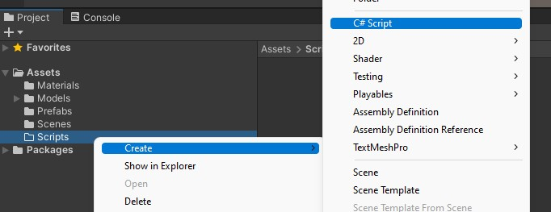

1. In Visual Studio, add the following script and save (WILL PROVIDE EXPLANATION LATER):

    ```csharp
    using System.Collections;
    using System.Collections.Generic;
    using UnityEngine;
    
    public class PlayerControls : MonoBehaviour
    {
        public float moveSpeed = 5;
    
        // Start is called before the first frame update
        void Start()
        {

        }

        void Update()
        {
            //Creating a direction vector based on the input axes (X being Horizontal direction, Y being 0 as we do not want the player to move beyond the plane and Z being Vertical direction).
            Vector3 direction = new Vector3(Input.GetAxisRaw("Horizontal"), 0, Input.GetAxisRaw("Vertical"));
            //Change the position transform by the direction vector times the preset movement speed and the time.
            transform.position += direction * moveSpeed * Time.deltaTime;
            //Makes the character look towards the vector's direction.
            transform.LookAt(transform.position + direction);
        }
    }
    ```

1. In the Unity editor, add the **PlayerControls** script as a component to **Player**. You can do so by dragging the script onto the **Player** GameObject. You can verify that the script became a component by looking at the Player GameObject in the inspector window.

    

1. Press **Play** to test the script.

    - Press the **right arrow** key to move the **Player** to the right.
    - Press the **left arrow** key to move the player to the left.
    - Press the **up arrow** key to move the player forward.
    - Press the **back arrow** key to move the player back.

    

### Create Character Ball Hold

When the game starts, the basketball is placed at a hold position in front of the player. Create a hold position for the player.

1. In the **Hierarchy** window, select **Player**. Right-click and select **Create Empty**. Name the object **HoldPos**.

    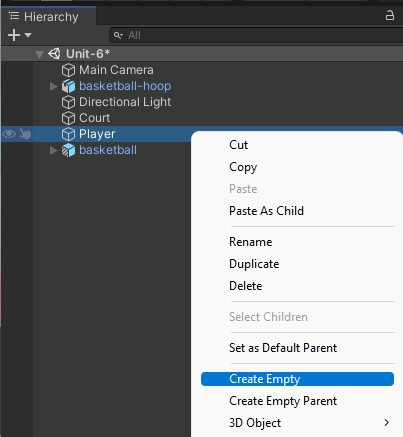

1. The **HoldPos** should be placed in front of the **Player** at about arms height (slightly above the half-way mark of **Player**). Modify the **HoldPos Transform Position** to **0, 0.2, 1.2**. This positions the **HoldPos** in front of the player and a short direction upwards.

    

1. Using code, place the **basketball** at the **HoldPos** for the start of the game. In Visual Studio, add a `GameObject` variable for the **basketball** and a `Transform` variable for the position of `HoldPos` to the **PlayerControls** script:

    ```csharp
    public GameObject basketball;
    public Transform holdPos;
    ```

    The `basketball` variable holds the `basketball` GameObject. The `HoldPos` variable holds the position of the `HoldPos` GameObject. You can use these two variables together to reposition the **basketball**.

1. In the `Start()` method, add the following to position the `basketball` at the position of `holdPos` for the start of the game:

    ```csharp
    void Start()
    {
        basketball.transform.position = holdPos.position;
    }
    ```

1. In the Unity editor, expand the **Player Controls** script component on the **Player**. Drag the **basketball** GameObject into the **Basketball** field. Also, drag the **HoldPos** GameObject into the **Hold Pos** field.

    

1. Press **Play** to test the script. The **basketball** be positioned at the **HoldPos** when the scene starts.

### Hold Ball Overhead

Before the player can shoot the ball, they must hold the ball over their head. This ensures that the ball is held at an optimal height for the shooting arc that you'll later create. Since the player can only hold the ball if the ball is not already shooting towards the hoop, you'll need to create boolean logic to account for the status of the ball. Create an overhead position for the ball and a conditional statement that checks whether the ball is being held by the player. If the player is holding the ball, use the **space bar** key to hold the ball overhead.

1. In the **Hierarchy** window, select **Player**. Right-click and select **Create Empty**. Name the object **OverheadPos**.

    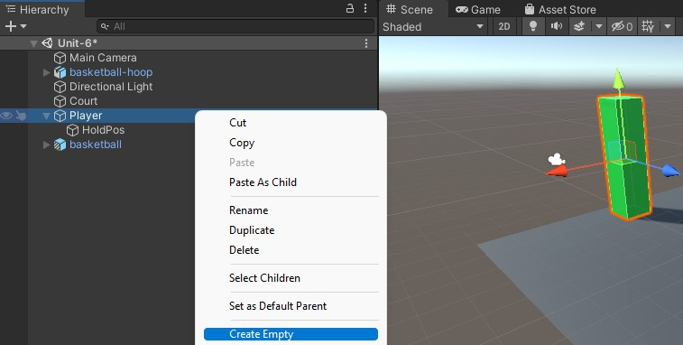

1. The **OverheadPos** should be placed in front of the **Player** above their head. Modify the **OverheadPos Transform Position** to **0, 0.5, 1.2**. This positions the **OverheadPos** in front of the player and slightly above their head.

    

1. In the **PlayerControls** script, create a `Transform` variable for the position of `OverheadPos`.

    ```csharp
    public Transform overheadPos;
    ```

1. Next, create two boolean (`true`/`false`) variables that'll define whether the ball is in the **Player** hand's or flying towards the hoop.

    ```csharp
    //Our game will start with the ball in the character's hand, thus the assigned value is true.
    private bool isBallInHands = true;
    private bool isBallFlying = false;
    ```

    At the start of the game, the **basketball** is in the **Player** hands. Therefore, at the start of the game `isBallInHands` is `true` and `isBallFlying` is `false`.

1. Next, add a conditional statement that checks whether the ball is being held by the **Player**. If the ball is in their possession, then pressing the **space bar** on the keyboard will raise the ball to the **OverheadPos**. Add the following conditional statement below in the `Update()` method after the Player's movement controls:

    ```csharp
    if (isBallInHands)
    {
        //If it is, we will define the space key as the key to hold the ball over the character's head.
        if (Input.GetKey(KeyCode.Space))
        {
            basketball.transform.position = overheadPos.position;
        }
        else
        {
            basketball.transform.position = holdPos.position;
        }
    }
    ```

1. In the Unity editor, expand the **Player Controls** script component on the **Player**. Drag the **HoldPos** GameObject into the **Overhead Pos** field.

    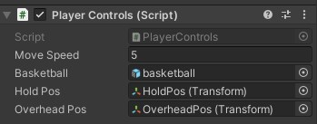

1. Press **Play** to test the script. Press the **space bar** key to raise the **basketball**.

### Shoot the Ball

Once the ball is placed above the player's head, the player can shoot the ball. The player aims for a target (which is essentially the **basketball hoop**. The ball is considered to be shot once the **space bar** key is lifted. Create a GameObject for the **target** positon and a conditional statement that checks whether the **space bar** key has been lifted. If the **space bar** key is lifted, then shoot the ball.

1. In the **Hierarchy** window, select **basketball-hoop**. Right-click and select **Create Empty**. Name the object **TargetPos**.

    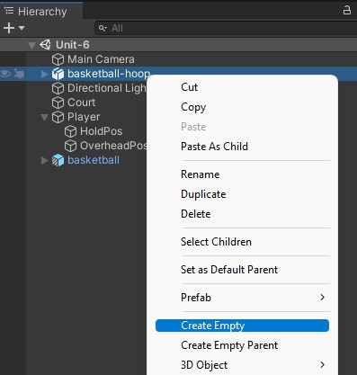

1. The **TargetPos** should be placed in front of the hoop. Modify the **TargetPos Transform Position** to **-0.4, 12, -2.4**. This positions the **TargetPos** at the hoop of **basketball-hoop**.

    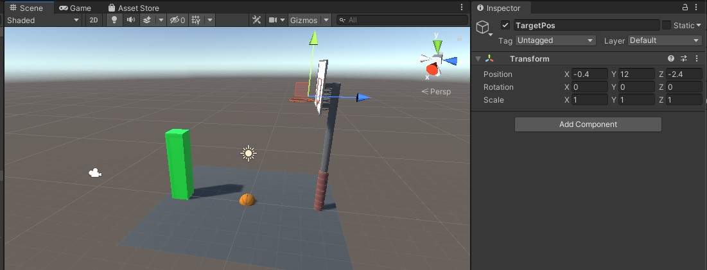

1. In the **PlayerControls** script, create a `Transform` variable for the **TargetPos** and a `float` variable for the length of time that the `basketball` is in the air.

    ```csharp
    public Transform targetPos;
    private float T = 0;
    ```
1. Within the `if (isBallInHands)` statement modify the statement to include the `transform.LookAt()` method:
    ```csharp
    if (isBallInHands)
    {
        //If it is, we will define the space key as the key to hold the ball over the character's head.
        if (Input.GetKey(KeyCode.Space))
        {
            basketball.transform.position = overheadPos.position;
            transform.LookAt(targetPos.parent.position);
        }
        else
        {
            basketball.transform.position = holdPos.position;
        }
    }
    ```

    The `transform.LookAt()` method faces the **Player** in the direction of the **basketball-hoop**.

1. Add another conditional statement within the `if (isBallInHands)` statement that checks whether the **space bar** key has been lifted:

    ```csharp
    if (Input.GetKeyUp(KeyCode.Space))
    {
        //For the ball to be shot, it must leave the character hands, so we make the boolean variable false.
        isBallInHands = false;
        //To begin shooting, we change the boolean flying to true (as the ball starts flying from the hands)
        isBallFlying = true;
        //And restart the time (so that the new series of events can be easily written)
        T = 0;
    }
    ```

1. The next step is to add what happens once the **basketball** is shot. Once the **basketball** is shot, the program uses two vector points (`TargetPoint` and `OverHeadPos`) to determine the direction of the **basketball**. A new vector is created from these vectors and the **basketball** position is changed accordingly. Add the following conditional statement after the `if (isBallInHands)` statement.

    ```csharp
    if (isBallFlying)
    {
        //Time variable is assigned a new value based on the time the event starts
        T += Time.deltaTime;
        //duration of travel
        float duration = 0.5f;
        //This variable allows for the interpolation to be accurate, as we want a set duration for the shooting.
        float t01 = T / duration;  
      
        Vector3 point_A = overheadPos.position;
        Vector3 point_B = targetPos.position;
        //Lerp is the linear interpolation function, will result in a new vector that will represent the trajectory from A to B.
        Vector3 pos = Vector3.Lerp(point_A, point_B, t01);
    }
    ```

1. To shoot the **basketball** in a realistic way, you can create an arc and add it to the `basketball` position once shot. Add the following in the `if (isBallFlying)` statement:

    ```csharp
    //Arc created using sine function
    Vector3 arc = Vector3.up * 5 * Mathf.Sin(t01 * 3.14f);
    //Moves the ball in an arc function 
    basketball.transform.position = pos + arc;
    ```

1. In the Unity editor, expand the **Player Controls** script component on the **Player**. Drag the **TargetPos** GameObject into the **Target Pos** field. Also, drag the **HoldPos** GameObject into the **Hold Pos** field.

    

1. Press **Play** to test the script. Press and release the **space bar** key to shoot the ball. Notice that although the **basketball** shoots in an arc towards the **TargetPos**, the **basketball** continuously bounces up and down in the air. You can add physics to resolve this problem.

### Add Physics to the Basketball

Physics is necessary for the ball to move as intended once it's shot into the air. Usually, when a basketball is shot, the ball also rolls on the ground. Adding a **Rigidbody** to the **basketball** enables the physics that's needed for these actions.

1. In the **Hierarchy**, select the **basketball** and add a **Rigidbody** component.

    

1. You'll manipulate the physics for the object within the **PlayerControls** script. Therefore check the **Is Kinematic** box. If **Is Kinematic** is enabled, the object is not driven by the physics engine, and can only be manipulated by it's Transform.

    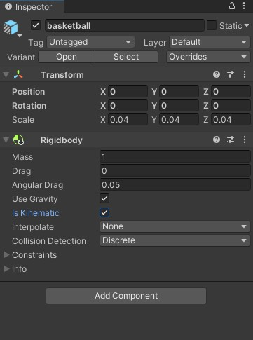

1. In the **PlayerControls** script, add the following at the end of the `if (isBallFlying)` statement:

    ```csharp
    if (t01 >= 1)
    {
        isBallFlying = false;
        basketball.GetComponent<Rigidbody>().isKinematic = false;
    }
    ```

### Add a Collider to the Basketball

Currently, after the basketball is shot, the ball falls through the **Court**. A collider creates an invisible mesh around the ball that'll enable the ball to instead collide with the **Court**. Add a **Sphere** collider to the **Basketball**.

1. In the **Hierarchy**, select the **basketball** and add a **Sphere Collider** component.

    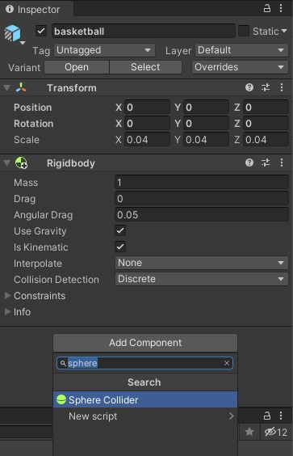

1. Now that **basketball** has a collider, the collider needs to be resized to fit the shape of the ball. In the **Sphere Collider** properties, select **Edit Collider** and resize the collider.

    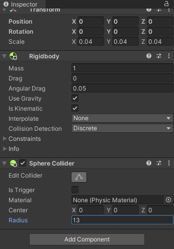

1. Press **Play** to test the changes. After the **basketball** is shot, the ball falls to the ground and stays in place.

### Pick Up the Ball

After the player takes a shot, the **basketball** falls to the court and stays in place. The player should instead receive the ball back to take another shot. Using code, create logic for the player to get the **basketball** after taking a shot.

1. In the **Player Controls** script, add the following after the `if (isBallFlying)` statement and outside of the `Update()` method:

    ```csharp
    //when the collision trigger happens, this method is executed.
    private void OnTriggerEnter(Collider other)
    {
    //Conditional: If the ball isn't flying or has not been picked up yet, pick up the ball and activate its Rigidbody component's kinematics.
    if (!isBallInHands && !isBallFlying)
    {
        isBallInHands = true;
        basketball.GetComponent<Rigidbody>().isKinematic = true;
    }
    ```

1. In the **Hierarchy**, select the **Player**. Now in the **Inspector**, go to the object's **Box Collider** and click on the **isTrigger** box.

    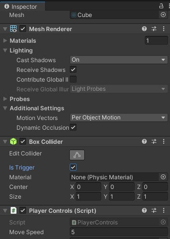

1. Press **Play** to try out the game. After the **basketball** is shot, the **basketball** returns to the **HoldPos** and is ready for another shot. As the player moves around the court, the player's orientation changes to face the **basketball-hoop** before taking a shot.

    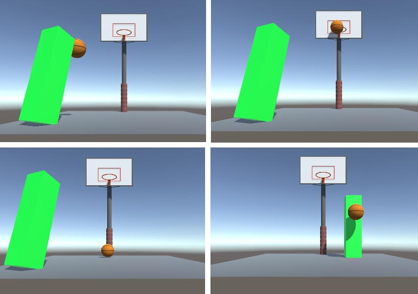

## Solution

To view the project sample for this activity, import the **Unit 7 Assignment** Unity package that's within the [XR Development for Beginners](https://github.com/microsoft/xr-development-for-beginners) repository.

**How to Import a Package into Unity**

1. In top navigation menu, select **Assets > Import Package > Custom Package**.
1. In the **Import Unity Package** window, select **All** then **Import**.
1. Once the package is imported, open the **Unit-7** scene.
